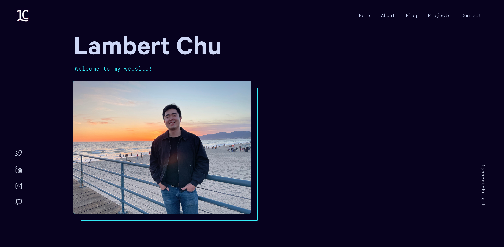

<h2 align="center">
  <a href="https://lambertchu.com" target="_blank"> Lambert Chu's Personal Website</a>
</h2>
<h2 align="center">
   (Fork of <a href="https://brittanychiang.com" target="_blank"> brittanychiang.com - v4)</a>
</h2>

<p align="center">
  Built with <a href="https://www.gatsbyjs.org/" target="_blank">Gatsby</a> and hosted on <a href="https://aws.amazon.com" target="_blank">AWS</a>
</p>



## 🚨 Forking this repo

Yes, you can fork this repo. Please give proper credit to Brittany Chiang for her awesome work building the original website by linking back to [brittanychiang.com](https://brittanychiang.com). Please link back to [lambertchu.com](https://lambertchu.com) as well. Thanks!

## 🛠 Installation & Set Up

1. Install the Gatsby CLI

   ```sh
   npm install -g gatsby-cli
   ```

2. Install and use the correct version of Node using [NVM](https://github.com/nvm-sh/nvm)

   ```sh
   nvm install
   ```

3. Install dependencies

   ```sh
   yarn
   ```

4. Start the development server

   ```sh
   npm start
   ```

## 🚀 Building and Running for Production

1. Generate a full static production build

   ```sh
   npm run build
   ```

1. Preview the site as it will appear once deployed

   ```sh
   npm run serve
   ```

## 🎨 Color Reference

| Color          | Hex                                                                |
| -------------- | ------------------------------------------------------------------ |
| Navy           |  `#07011F` |
| Light Navy     |  `#112240` |
| Lightest Navy  |  `#233554` |
| Slate          |  `#8892b0` |
| Light Slate    |  `#a8b2d1` |
| Lightest Slate |  `#ccd6f6` |
| White          |  `#e6f1ff` |
| Green          |  `#64ffda` |
