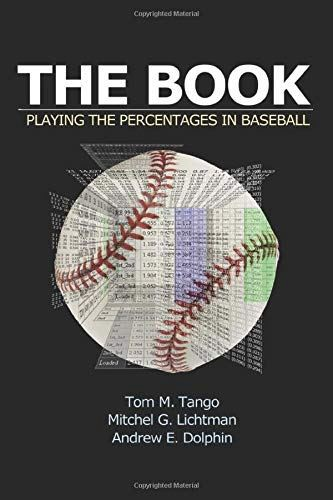
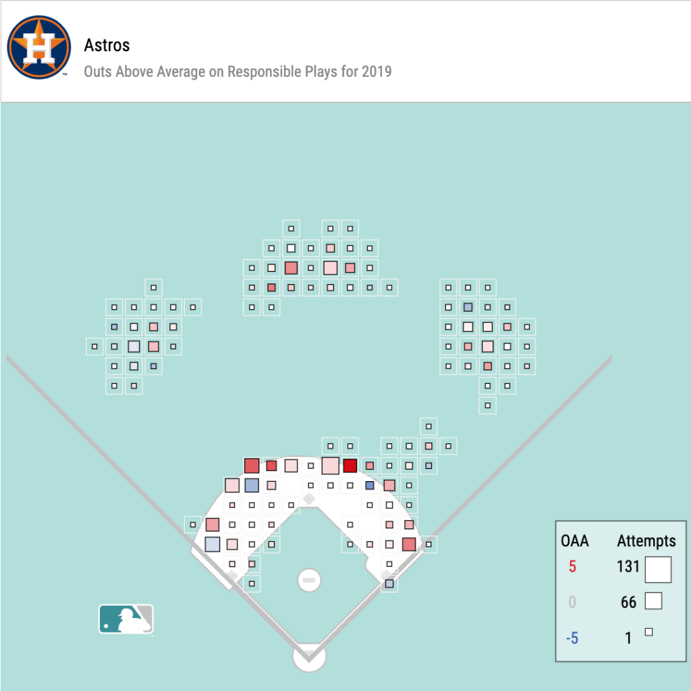

Compared to the past, MLB front offices are now open to more job seekers. But we’ve still got a long way to go before anyone, regardless of their background, can really pursue that opportunity. You can check out my full thoughts about this in [Part 1](/blog/breaking-into-baseball) of my blog post!

For those of you out there interested in working in baseball, I’m sharing a list of my favorite resources that helped me join an MLB front office. This is far from an exhaustive list, but I found these books, websites, online personalities, and other resources to be tremendously helpful for learning from today’s greatest baseball minds.

Without further ado, let’s get at it!

---

### Books

1.  [_The Book: Playing The Percentages In Baseball_](https://www.amazon.com/Book-Playing-Percentages-Baseball/dp/1494260174). There’s a reason why us baseball nerds just call this _The Book_. It completely changed the way I think about baseball, or any strategic game for that matter. If there’s only one thing to look into in this entire list, this is it.
2.  [_The MVP Machine: How Baseball’s New Nonconformists Are Using Data to Build Better Players_](https://www.amazon.com/MVP-Machine-Baseballs-Nonconformists-Players/dp/1541698940). With the help of modern technology, we’re now living through the age of “Moneyball 2.0” — _player development_.
3.  [_Swing Kings: The Inside Story of Baseball’s Home Run Revolution_](https://www.amazon.com/Swing-Kings-Inside-Baseballs-Revolution/dp/0062872109/ref=pd_sbs_14_5/147-3367066-9770843?_encoding=UTF8&pd_rd_i=0062872109&pd_rd_r=a04f4181-cd14-4bbe-8fb2-87b76abeb3bb&pd_rd_w=U0km6&pd_rd_wg=unJ6M&pf_rd_p=0b2db3d1-33eb-418a-9672-bb9bd54808e8&pf_rd_r=NWGHMSWSNYXM2MN66FN0&psc=1&refRID=NWGHMSWSNYXM2MN66FN0)
4.  [_Big Data Baseball: Math, Miracles, and the End of a 20-Year Losing Streak_](https://www.amazon.com/Big-Data-Baseball-Miracles-20-Year/dp/1250063507/ref=pd_sbs_14_8?_encoding=UTF8&pd_rd_i=1250063507&pd_rd_r=a04f4181-cd14-4bbe-8fb2-87b76abeb3bb&pd_rd_w=U0km6&pd_rd_wg=unJ6M&pf_rd_p=0b2db3d1-33eb-418a-9672-bb9bd54808e8&pf_rd_r=NWGHMSWSNYXM2MN66FN0&psc=1&refRID=NWGHMSWSNYXM2MN66FN0)
5.  [_Future Value: The Battle for Baseball’s Soul and How Teams Will Find the Next Superstar_](https://www.amazon.com/Future-Value-Battle-Baseballs-Superstar/dp/1629377678/ref=pd_lpo_14_img_0/147-3367066-9770843?_encoding=UTF8&pd_rd_i=1629377678&pd_rd_r=d31ec38f-da31-4a59-af22-4242e1184c40&pd_rd_w=dNF0J&pd_rd_wg=v1OHI&pf_rd_p=7b36d496-f366-4631-94d3-61b87b52511b&pf_rd_r=NWGHMSWSNYXM2MN66FN0&psc=1&refRID=NWGHMSWSNYXM2MN66FN0)
6.  [_The Mental Game of Baseball_](https://www.amazon.com/Mental-Game-Baseball-Guide-Performance/dp/1888698543). Ok, this doesn’t really relate to working in baseball operations, but it’s an awesome book for mental performance. Back in my playing days, it taught me how to deal with failure, high expectations, and stress — which has translated well to life ever since.

### Websites

1.  [Baseball Savant](http://baseballsavant.com/). The go-to site for Statcast data and [visualizations](https://baseballsavant.mlb.com/visuals). It also has very cool leaderboards of advanced metrics, such as [expected wOBA](https://baseballsavant.mlb.com/expected_statistics) (xwOBA).
2.  [Fangraphs](https://www.fangraphs.com/). The latest high-quality baseball stats, research, and articles.
3.  [Baseball Reference](https://www.baseball-reference.com/). STATS. EVERYWHERE.
4.  [MLB Technology Blog](https://technology.mlblogs.com/)
5.  [Driveline Baseball Blog](https://www.drivelinebaseball.com/blog/). These guys are industry leaders in player performance and sports science, with a lot of their staff now working for MLB teams.
6.  [The Athletic](https://theathletic.com/). Probably the best sports news coverage out there, and also features excellent podcasts and videos.
7.  [SportTechie](https://www.sporttechie.com/)
8.  [Front Office Sports](https://twitter.com/frntofficesport)

### People

1.  [Tom Tango](https://twitter.com/tangotiger). Co-author of _The Book_ and renowned sports researcher/[blogger](http://www.tangotiger.com/index.php).
2.  [Bill James](https://twitter.com/billjamesonline). The father of sabermetrics and the Moneyball revolution. [Here’s a fascinating panel discussion](https://www.youtube.com/watch?v=kcQZZKqKe3k) featuring both Tango and James.
3.  [Kyle Boddy](https://twitter.com/drivelinebases)
4.  [Eric Cressey](https://ericcressey.com/)
5.  [Nate Silver](https://twitter.com/NateSilver538)
6.  Aaaand a bunch of other great follows: [Pitching Ninja](https://twitter.com/PitchingNinja), [Ben Lindbergh](https://twitter.com/BenLindbergh), [Travis Sawchik](https://twitter.com/Travis_Sawchik), [Kiley McDaniel](https://twitter.com/kileymcd), [Eric Longenhagen](https://twitter.com/longenhagen), [Keith Law](https://twitter.com/keithlaw), [Eno Sarris](https://twitter.com/enosarris), [Daren Willman](https://twitter.com/darenw), [Alan Nathan](https://twitter.com/pobguy)

### Podcasts

1.  [Effectively Wild: A Fangraphs Baseball Podcast](https://open.spotify.com/show/18kbXy9p0jHw3o8f2cQlCj?si=jQjchU8zSJiSwdv8rCZfnA)
2.  [Flying Coach with Steve Kerr and Pete Carroll](https://open.spotify.com/show/3yiVBSbk0CperZN9ZhsbEw?si=GzgWexxgQpmBEyisyGfemw)
3.  [Against the Rules with Michael Lewis](https://open.spotify.com/show/5vaBQ06qUNNU5w90KMnqw8?si=pAhwBBJjQACdChmy7K695w)
4.  [Driveline R&D Podcast](https://open.spotify.com/show/2IXxzxBjM6J8fBONrJauUR?si=Ul1uFlERTrCihLgfNdpE7Q)
5.  [Measurables](https://open.spotify.com/show/1B2KCrfMM6sDfNICsyVDlW?si=qNZdjaNFQUmxiY-X0cGihA)

### Analytics and statistics

Analytics have taken the game by storm, and teams are now heavily focused on statistical analysis and machine learning to answer all types of baseball questions. That can cover anything from projecting players’ future stats to deciding optimal in-game strategy.

From my experience, teams rely heavily on [SQL](https://www.codecademy.com/learn/learn-sql) for querying data from relational databases and [R](https://www.codecademy.com/learn/learn-r) for analysis and modeling. Sometimes teams also use [Python](https://www.codecademy.com/learn/learn-python-3), although it doesn’t seem as popular as R in the industry for now.

There are a lot of great textbooks and online courses dedicated to sports analytics, machine learning, statistics, etc. Here are a handful I’ve used to learn foundational skills:

#### Textbooks & Courses

1.  [An Introduction to Statistical Learning](http://faculty.marshall.usc.edu/gareth-james/ISL/index.html)
2.  [R for Data Science](https://r4ds.had.co.nz/)
3.  [Hands-on Machine Learning with SKLearn, Keras, Tensorflow](https://www.amazon.com/Hands-Machine-Learning-Scikit-Learn-TensorFlow/dp/1492032646)
4.  [Fast.ai](https://www.fast.ai/)
5.  [Andrew Ng’s machine learning course](https://www.coursera.org/learn/machine-learning)

#### Open-source software packages

1.  [baseballr](https://github.com/BillPetti/baseballr)
2.  [pybaseball](https://github.com/jldbc/pybaseball)
3.  [Lahman’s baseball database](http://www.seanlahman.com/baseball-archive/statistics/)
4.  [Tidyverse](https://www.tidyverse.org/)
5.  [pandas](https://pandas.pydata.org/)

---

As you might’ve noticed, my list leans heavily on analytics and technology. I may be a bit biased because I really like those things… but modern technology has revolutionized decision-making in companies of all industries. MLB teams are no exception to that.

If you want to work in sports, I highly recommend that you **stay up-to-date with the latest trends in sports technology**. Top teams are always looking to tech for a competitive edge. [Check out my latest post](https://lambertchu.com/2020/08/04/the-next-data-revolution-in-baseball) about _another_ data revolution that’s coming to baseball — and how the sport is going to change once more.

Of course, this list doesn’t cover _all_ of the amazing resources and talented people that are out there in our industry. If you think there’s anything cool that I missed, I’d love to hear about it. And if you have any questions for me, feel free to leave a comment or send me a [DM on Twitter](https://twitter.com/lambertchu94)!
