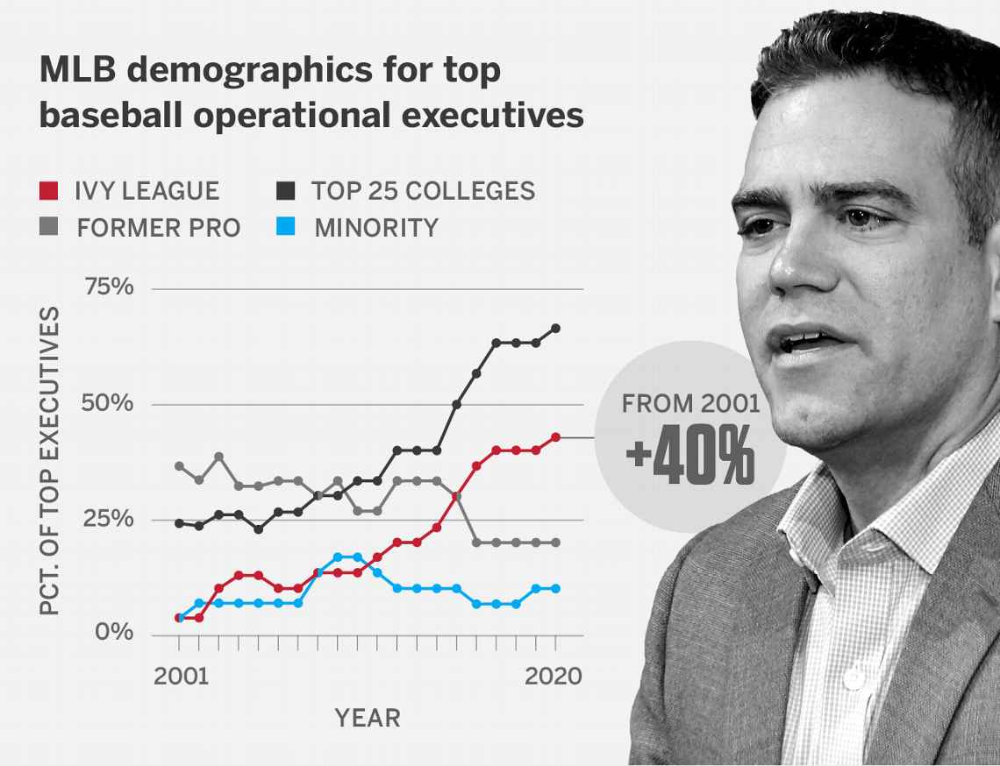

This year’s been incredibly tough for so many people, and it’s no exception for folks in the baseball industry. Despite all of negativity in the news these days, I still feel grateful to be here. After all, it’s a rare opportunity to be working in baseball!

When I was a kid, I always thought that working for MLB teams was reserved for insiders — whether they were top-tier players after they hung up their cleats, or business tycoons working closely with billionaire team owners. I didn’t have any relatable role models to look up to, so those jobs just seemed out of reach.

As many sports fans know, the story of Michael Lewis’s _Moneyball_ and the Oakland A’s helped turn everything upside down. Before then, baseball seemed like a “boys’ club” of insiders; the game had become content with using the same strategies and systems over and over again.

Everything changed when people heard about the inefficiencies of baseball and the sports world in general. That gradually paved the way for outsiders, especially math nerds that could barely hit the ball out of the infield, to bring fresh perspectives. It wasn’t easy at first; many outsiders were met with skepticism and resistance from the establishment. But eventually, the new ideas won over and helped revolutionize the way the game is played today.

Despite the gradual acceptance of outsiders into the game, front offices are still employing very few minorities, women, and others of different socioeconomic backgrounds. For me, this is an area that hits close to home. Even though it was a huge step forward to see outsiders gain acceptance in baseball, I had a hard time going for a job that still didn’t seem like was meant for me.

_Since 2001, there’s been a massive rise in baseball executives from elite colleges (3% to 43%). In the meantime, there’s been only a modest increase in minority executives (3% to 10%). [Source: ESPN](https://www.espn.com/mlb/story/_/id/29369890/inside-rise-mlb-ivy-league-culture-stunning-numbers-question-next)\_

After a while, an influential role model helped me make the leap: Farhan Zaidi, the current president of baseball operations for the San Francisco Giants. He’s a person of color and MIT grad that [turned down the rigor of academia for the ballpark office](https://www.espn.com/mlb/story/_/id/26544614/how-farhan-zaidi-left-berkeley-became-baseball-pioneer) — and has been absolutely crushing it ever since. It was so encouraging to see people I could personally relate to like Farhan reach the pinnacle of the baseball world.

I’m very grateful to have gotten my baseball operations opportunity with the forward-thinking Yankees, who are still the only team to have hired _two_ female assistant GMs as of 2020. During the difficult times of the George Floyd protests, we discussed how we could do our part in supporting people of color. One method discussed is to offer mentorship to minorities in order to break into the industry. I’m ready to do my part to help. After all, as a Chinese American that’s pitched just one inning of Division 3 baseball (but with a 0.00 ERA), I know how hard it is to succeed as an outsider amongst outsiders.

For that reason, I’m sharing a list of resources that have been incredibly helpful on my journey to working in baseball — which I still maintain and use today. You can find it in my next blog post by [clicking here](/blog/baseball-resources).

It’s far from a comprehensive list, but I hope it’ll be a launchpad for anyone interested in breaking into the industry. At the very least, I hope it’ll educate fans are changing the sport today and expand the diverse fanbase of our pastime!
