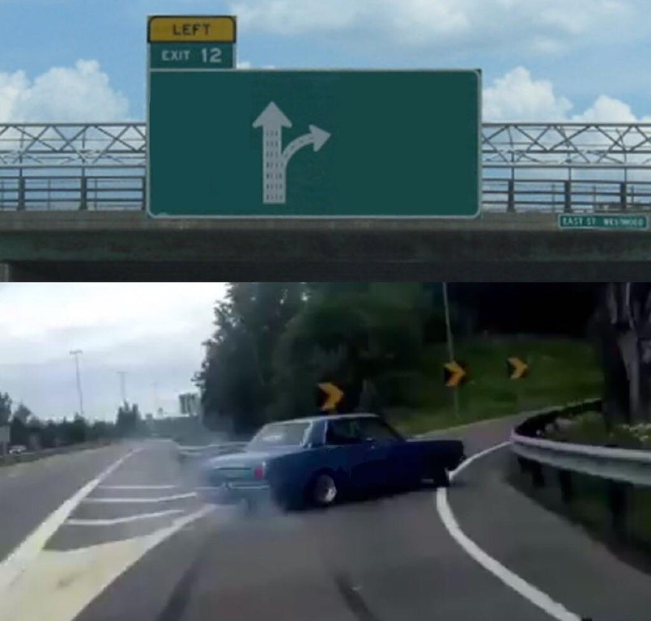
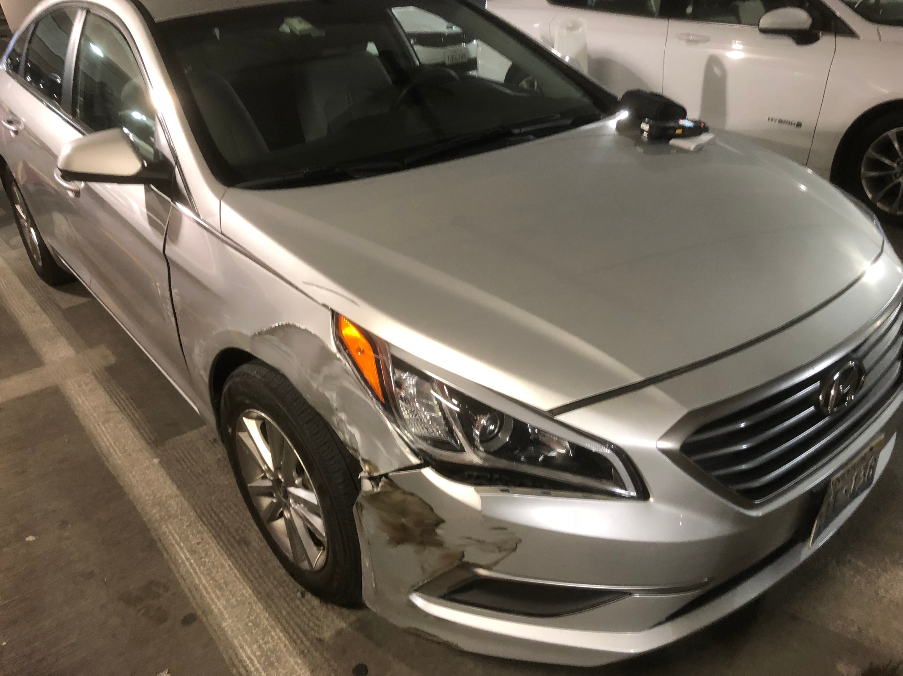

Three years ago today, I got into a car accident.

I was in a rental car with my former co-founders, Fil and Matt. We were on a highway in Mountain View headed to our final interview with Y Combinator. The interview was supposed to start in just ten minutes, and we were anxious about cutting it so close after a really ill-advised run to Taco Bell.

I made a silly, last-minute navigation error. Fil made a sharp, last-second turn to try to make the highway exit. Next you we knew, we swerving towards the exit like this:

…and then **BAM**!! We crashed right into another car in the lane beside us. We narrowly avoided a second collision with a highway guardrail (which would’ve been a disaster) and screeched to a halt beside it.

---

We sat there in complete shock for a few seconds. We looked at each other, and thankfully, there wasn’t a scratch on any of us. The other driver was pissed as hell, but thankfully, he was also completely fine.

But my head was spinning from processing what just went down. _Is this real life? This CANNOT be happening to us right before the biggest interview of our careers…_

Fil stepped up to deal with the aftermath of the collision with the other driver, which meant that Matt and I had to make a last-ditch effort to conduct our YC interview.

We jumped out of the car and sprinted down the highway ramp, sticking out our thumbs at passing cars like idiots trying to hitchhike a ride. Everyone turned us down. We called a Lyft that somehow got to us quickly and dropped us off at YC headquarters, arriving “only” about ten minutes late. Amazingly, the YC partners were running behind schedule, so we made it right on time.

Matt and I burst into the interview room, sweaty and out of breath, and tried to conduct the interview as calmly as possible while pretending nothing was wrong. After several back-and-forths, the CEO of YC, Michael Seibel, noticed something was off. He asked, “Where is your third cofounder?”

“Uhhhh… we actually got into a car accident on the way here and he’s taking care of the car right now.”

The YC partners were shocked. They told us to get out of there to handle that situation first and rescheduled the interview for a couple of hours later that day.

---

After Fil re-joined us and we finally had time to breathe and rest in the lobby, we stopped giving a damn about the interview. Hey, we already made it this far… _we’re still friggin alive_!! All of our earlier stress about the interview evaporated and was replaced by a strange sense of calmness.

We went back into the room a second time and nailed the interview.

Months later, Michael confirmed that our smooth recovery from the car accident actually helped us win them over as resilient startup founders. I think he was really onto something there… it felt like there was a “car accident” on a daily basis while running an early-stage startup!

---

Three years later, I look back and laugh at how the world was seemingly going to end during those agonizing twenty minutes. That accident could’ve seriously injured us all, but instead, it helped us get into an awesome startup accelerator and breathed new life into our company. We almost made a company-altering or even _life-altering_ mistake, yet somehow, things ended up for the better.

I had two big takeaways from the day, and I find them as relevant as ever in 2020.

First, we can never take our health for granted, as it can be taken away from us at any moment (especially after eating at Taco Bell. Nothing good ever happens after eating at Taco Bell).

Second, _anything_ can go wrong at any moment and it’s often out of our control — but it _is_ within our control to bounce back and turn setbacks into new opportunities.

We were lucky enough to sprint away from that car with our lives, and even luckier to walk away with a chance to take a startup to greater heights.

Disclaimer: There are important risk factors that should be considered when crashing a car before an interview. Results may vary.
