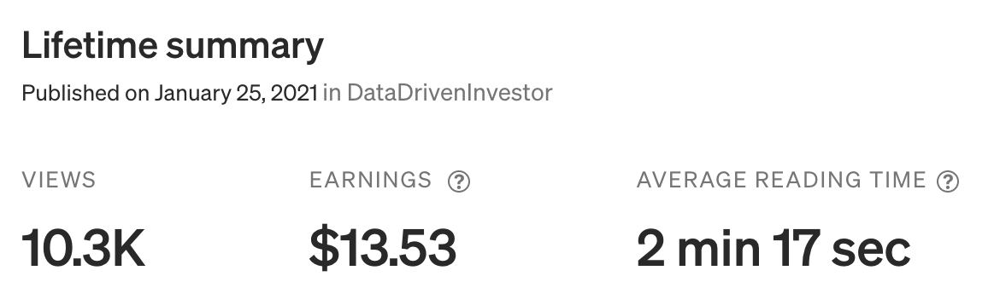

It’s been one year since I started this blog. When I first started, I wasn’t exactly sure what to write about or how much time to devote to it. I just wanted to scratch an itch to get my ideas out to the world.

In the back of mind, I was hoping to grow a big online audience over time. The problem is that I’ve only been publishing once every month or two, which simply isn’t enough content to reach that goal.

So, what’s been the point of having a blog? And why am _I_, a nobody with less than 300 Twitter followers, telling you to start publishing things too?

Over the long run, there are plenty of benefits to enjoy from creating content, especially when it comes to writing. With some hard work and a little bit of luck, you just might stumble across new opportunities in the future that you never would expect today.

### Automate the Storytelling Process

First and foremost, publishing an article is like writing a piece of software. Just like code is meant to execute a specific task on a computer whenever you want, an article serves a specific purpose whenever someone reads it — whether it’s to tell a story or answer a question. By publishing an article, you’re able to serve a purpose at scale. Instead of telling a story again and again to people you meet, you can write it up once and let them all read it whenever they want.

This is especially powerful in the age of the internet, where your ideas can reach complete strangers at any given time. All you have to do is write once for your ideas to be explained to anyone a countless number of times.

My furthest-reaching article was published on Medium: [“Why it’s time to invest in NBA Top Shot"](https://medium.datadriveninvestor.com/why-its-time-to-invest-in-nba-top-shot-c31025647d8).

I had less than 30 Medium followers at the time, but it garnered over 10,000 views on the platform. This is a tiny number in the big picture of internet content, but I at least made some kind of impact on people with that article. I sure couldn’t have done that by word-of-mouth alone.

In the end, I wrote down my thoughts once and avoided explaining my thoughts 10,000 different times.

Or at least that’s what I tell myself. I feel like I still had to explain NBA Top Shot to my mom about 10,000 different times.

### Clarify Your Thoughts

Albert Einstein once said, “If you can’t explain it simply, you don’t understand it well enough.” I could not agree more with that statement.

Part of the reason why writing is so damn difficult is that it’s a constant battle with yourself. You have to write down everything you know AND format it in a coherent argument to your readers. When you factor in what disagreers and internet trolls might say to counteract your points, you have to play devil’s advocate against yourself — and that’s when you realize that maybe, _just maybe_, you don’t know what the hell you’re actually talking about.

When I have an idea for an article, I go in with a list of notes about the subject and feel good about what I want to write. “I’ve done all of the homework already,” I think to myself. “Putting it into words should be a breeze!”

Nope. Not at all. In fact, I end up doing more research and learning during the actual writing process.

That’s the beauty of publishing online. It forces you to step up your game and sharpen the quality of your work for others to understand.

In the case of my NBA Top Shot article, it helped me think deeply about the pros, cons, and future of the platform. When I ultimately decided it made sense to me, I took the plunge to invest in Top Shot moments, months before everyone else hopped on the hype train. And yes, I still believe in the massive long-term potential for the platform despite the current bear market.

The process of putting your thoughts into words can be extremely difficult, but the level of understanding you achieve when you’re done is totally worth it.

### Increase the Odds of Serendipity

In the past, I’ve written about a variety of subjects including baseball, startup ideas, and sports betting. It turns out that my blog posts showcased my thinking and writing, which helped me land exciting opportunities with two different startups over the last few months.

This was _especially_ important to me at the start of the year. I had just decided to leave my previous job at the Yankees and had what was probably my third quarter-life crisis. There was a period of several months where I was anxiously searching for a new direction for my career.

By figuring out what to write, I had to think carefully what I wanted to do and what I was most passionate about. This helped me clarify the next steps to take in my career.

It was a massive bonus that my writing caught the attention of [Jonathan Bales](https://twitter.com/BalesFootball) and [Peter Jennings](https://twitter.com/CSURAM88), which helped me land my current job with [Lucky Trader](https://luckytrader.com/). I’m very fortunate to now be working at the intersection of my lifelong passions for technology and sports, as well as my newfound curiosity for NFTs and cryptocurrencies.

During the COVID era, it’s been especially hard to network in-person, whether it’s finding new opportunities or meeting interesting people. However, a lot of networking can be replicated online, oftentimes with greater reach and efficiency. I believe that publishing your work online is hands-down the best way to creating your own luck in finding new opportunities.

Here’s what Balaji Srinivasan, the former CTO of Coinbase and General Partner at Andreessen Horowitz, has to say about that:

<blockquote class="twitter-tweet">
Many founders aren’t hiring from Harvard. They’re hiring from Twitter.
&mdash; Balaji Srinivasan (@balajis) <a href="https://twitter.com/balajis/status/1387620334216437765?ref_src=twsrc%5Etfw">April 29, 2021</a></blockquote> 

I’m not one of those people that discount the value of college degrees, especially the ones from top schools. But in the competitive world that we live in today, having tangible work to show in public can help you stand out from the noise.

### Enjoy the Creative Process

The last benefit of publishing online? It can be a lot of fun.

I often experience writer’s block and can be busy with my day job (which is a classic excuse, but I bet you can relate!) There is a lot of inertia that stops me from getting started, but when I do get the ball rolling, the process becomes very addicting.

It’s an intoxicating experience to see your work take form into a coherent product. When I write an especially solid paragraph, I get very excited even if no one else has read it yet. If someone (aka _anyone_) reacts positively to it online, I get a massive adrenaline rush.

Most of us spend most of our time consuming, whether it’s on Netflix, Instagram, or Tik Tok. It gives us the momentary, easy hits of dopamine that keep us going through the day. But the creative process provides a much more meaningful sense of fulfillment that can last much longer.

### Just Send It

I’ve officially been writing online for a year now. After spending some time reflecting on this decision, I believe it’s been one of the most rewarding of my life. I may not reach my goal of building a huge online audience anytime soon, but I still gain a tremendous amount of knowledge and satisfaction by writing for myself at my own pace. As a result, I really recommend creating work publicly, even if you don’t care much about followers.

Needless to say, the same benefits apply to other forms of work besides writing, whether it’s publicizing your code on GitHub or sharing your ideas verbally on a podcast.

Going forward, I’ll take my own advice and start publishing more frequently. I plan on starting my own “crypto journal,” where I’ll document the weird and disruptive NFT/crypto projects I’m discovering during my new journey with Lucky Trader.

In a few short months, I’ve gained a lot of new ideas and insights that I would’ve loved to have known six months ago. It’ll be a fun project to document my learning process and hopefully help others that are new to this space.
