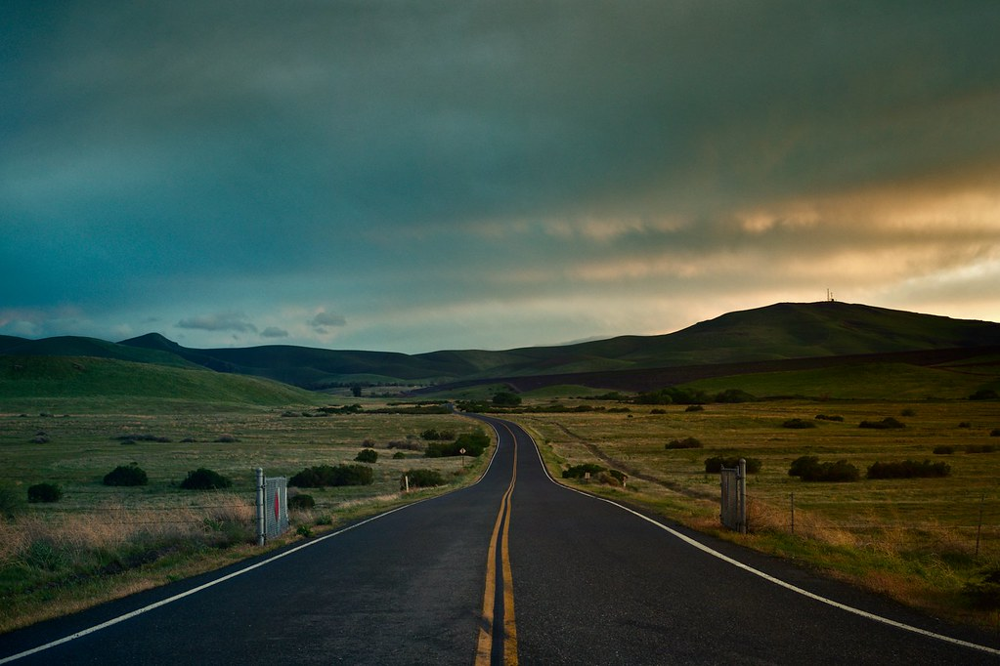

I thought I had walked away from social media for good.

For the longest time, I didn’t want to broadcast my thoughts on the Internet. Doing that felt distracting and narcissistic. Even worse, if I did post my honest thoughts online, _would people think less of me for my opinions_?

I was content with being low-key and off the web. But a failed startup and a global pandemic was all it took to change my opinions completely!

I learned more from working on a startup than anything else in my life, and I felt the need to share my learnings with others. In the meantime, like billions of others around the world affected by COVID-19, I consumed digital content more than ever while stuck at home. The disaster of the pandemic reminded me that our time is short and life is valuable, yet there’s an entire digital world still intact. If I could impact just one other person through the web, putting in the work would be worth it. Why should I keep my ideas to myself if they have a chance to influence or help people?

### What are my reasons for starting a blog?

I’ve thought of plenty of good reasons, but three stand out to me:

- **Connect with the world.** It’s time to step out of the shadows and make my voice heard. If I don’t try, I’ll never know who I could impact and who could impact me.
- **Create a realtime autobiography.** I want to share my process — the ups and the downs — of finding my way in this crazy world.
- **Build a personal brand**. Writing for an audience will keep me accountable for my work and help shape me into the person that I want to be.

I can live with my ideas not gaining any traction. I feel rewarded just by creating content and putting my thoughts onto paper (or webpages), and not hearing anything at all would actually be useful feedback. In the best case, other people will learn from my writing and find it amusing. In the worst case, I’ll have some ridiculous stories to show my future grandkids.

### What is my niche?

Besides the fear of public judgement, this was another huge roadblock for me to start writing. I noticed that most successful online personas have their own niche topic of expertise, but I had a hard time choosing just one thing, nor did I want to write exclusively about one thing.

I decided to just write about anything that (1) really piques my interest (2) makes for quality content and (3) I’m able to share publicly. Who knows — maybe there’ll be some weird topic I write about that will become my niche one day — but that’ll never happen if I don’t get started!

### Is starting a blog right for you too?

In all likelihood, yes! Even if you don’t feel like it’s true, I’m willing to bet that you have unique stories and insights that few others have but are eager to consume. Have you ever told a story to a friend that made them laugh or intrigued? If so, there’s at least one stranger out there that’d have the same reaction.

The cool thing is that sharing ideas is now easier to do at scale than ever before. The world is consuming online content like crazy, and all it takes is a click of a button to join that community.

If you’re thinking about starting a blog or are just starting out like me, I’d love to exchange ideas with you. If not, I’d be happy to connect anyway — leave a comment or send me a DM on Twitter!
