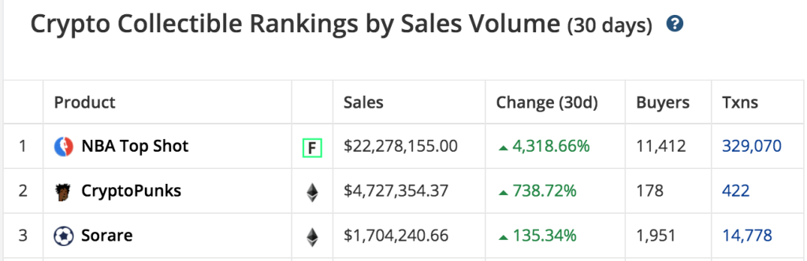
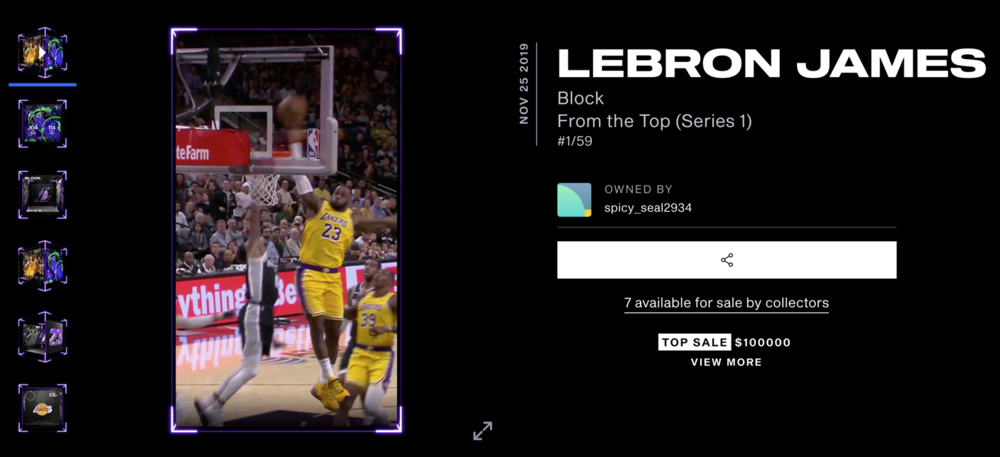
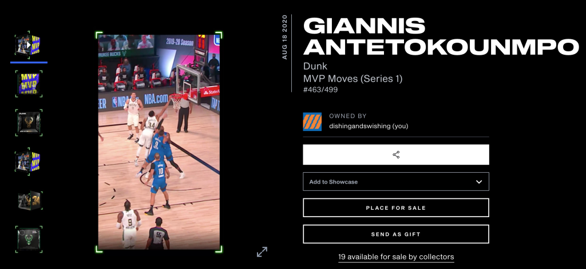
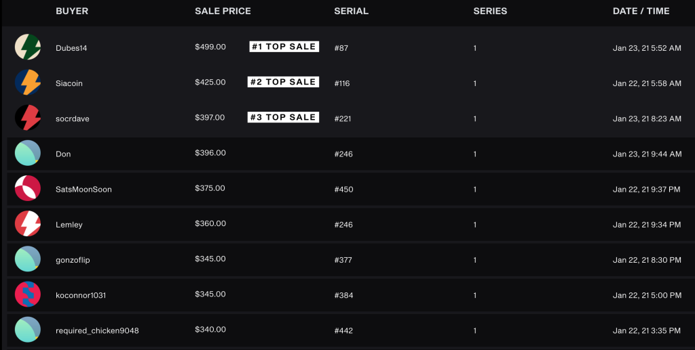
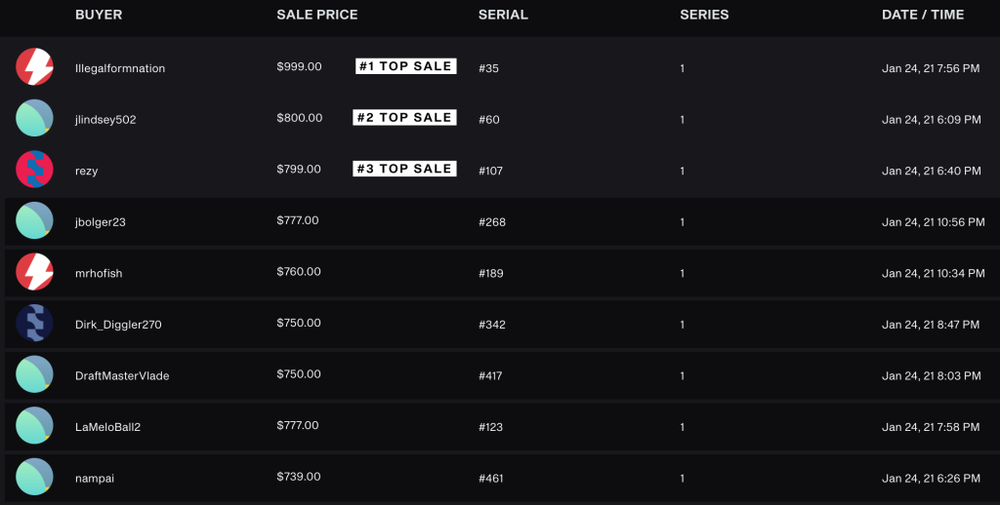

Basketball. Cryptocurrencies. Trading cards. Markets.

As different as they may seem, there’s a single product that combines all of them: [NBA Top Shot](https://nbatopshot.com), a blockchain-driven platform where you can buy and sell NBA highlights.

You can think of it as a mashup of Bitcoin and physical sports cards. Instead of trading cards, however, you trade video highlights from exciting “moments” in NBA games.

But wait! Can’t we just watch the same highlights on YouTube for free? Sure we can. We can also print an image of a Honus Wagner baseball card for free… but good luck trying to sell that copy for [$3 million](https://www.beckett.com/news/world-record-price-for-t206-honus-wagner-baseball-card-3-million-and-counting/)! The value of each digital moment comes from its authenticity and scarcity, which makes it very similar to commodities like gold, Bitcoin, artwork, and trading cards.

Top Shot’s early adoption has been no joke. Their marketplace sees [$1 million in sales](https://www.actionnetwork.com/news/nba-top-shot-blockchain-nba-highlight-marketplace) on a daily basis now. The product has raked in over $20 million in sales, most of which came in the last month alone. Dapper Labs, the company behind Top Shot, has [already been funded](https://venturebeat.com/2020/08/06/cryptokitties-creator-dapper-labs-raises-11-4-million-for-consumer-focused-flow-blockchain/) by VC giants like Union Square Ventures and Andreessen Horowitz, as well as NBA players like Andre Iguodala, Spencer Dinwiddie, and Aaron Gordon.

_NBA Top Shot is easily the most popular crypto collectible in the world. Source: [CryptoSlam!](https://cryptoslam.io/)_

There are still plenty of uncertainties about the platform, and I admit that the concept seemed crazy and silly to me at first. But now, I believe NBA Top Shot is here to stay.

Please keep in mind that this article is NOT meant to be investment advice. These are my personal opinions and should solely be used for informational purposes!

### Why NBA Top Shot will succeed

I believe that NBA Top Shot will become a popular marketplace, if not THE marketplace, for NBA fans to become:

1.  **Investors**: those who **invest** in the future success or popularity of NBA players.
2.  **Traders**: those who love finding market inefficiencies and **flipping** assets for good deals.
3.  **Collectors**: those who enjoy **owning** rare assets and showing them off.

There are a lot of people interested in doing _at least_ one of these things. And let’s not forget that there are billions of NBA fans around the world.

To me, this system sounds like a **stock market but with NBA players**, as it provides an indirect way to bet on the success of NBA players. This is appealing to investors, traders, and collectors alike, who may flock to young stars like Zion Williamson or to generational talents like Lebron James — both of whom had moments that just sold for $100,000 each!

_As of today, the King shares the crown for the most valuable Top Shot moment. Source: [NBA Top Shot](https://www.nbatopshot.com/moment/spicy_seal2934+0ce6787a-e854-43db-a29d-90faffa9311c)_

In theory, a similar system already exists with physical sports memorabilia, but that system is riddled with the many issues of physical assets. Collectors have to preserve the physical condition of their cards, deal with the hassle of shipping, and take risks buying from unknown eBay vendors. All of these factors make physical cards rather illiquid assets. Having purely digital collectibles that sit on the blockchain could change all of that.

### Prices are taking off

How quickly are NBA Top Shot’s moments growing in value? To find out, I decided to take a peek at my own collection. For reference, I bought my first pack in September 2020. Since then, I have bought two more packs and a handful of moments from the marketplace.

One of my most valuable moments is a highlight of the reigning MVP, Giannis Antetokounmpo, slamming down a dunk during the most recent NBA playoffs.

I bought this moment [from the marketplace](https://www.nbatopshot.com/listings/p2p/b73fe6f1-ae28-468b-a4b3-4adb68e7d6bc+6311056f-0bd3-48d1-90a1-8c8cdbdd98cd) for **$16** back on **December 5**.

I’m not gonna lie… I’m pretty cheap, so paying that much for a video clip worried me for a while. In the end, I pulled the trigger and was left wondering how much it’d be worth someday.

Turns out, I didn’t have to wait long to get an answer. NBA Top Shot gained SERIOUS momentum over the following month. While writing this blog post on January 23, I decided to check the most recent sales on the marketplace of other copies of my Giannis moment. Here’s a screenshot of the top three sales of all time, followed by the most recent sales on the marketplace:

Wow!! Taking the moment’s serial number into account, my moment was suddenly worth about $350. That’s a 2,088% return in about seven weeks.

The next day, I decided to take another look at the marketplace, just to make sure all of the numbers were accurate before publishing my blog post:

Ummm… EXCUSE ME?? Turns out my numbers were wrong! The sales doubled in price in less than two days. My moment is now worth about $750, bringing the total return to 4,588%.

To answer the original question: the moments are gaining value VERY quickly. My collection is still small-time compared to the ballers that have invested hundreds of thousands of dollars. Nevertheless, it’s clear as day that the value of Top Shot moments have skyrocketed.

### Why you should still be cautious

Of course, like _any_ asset in the world, there are reasons to be skeptical.

Top Shot moments fall under the category of [non-fungible tokens](https://en.wikipedia.org/wiki/Non-fungible_token) (NFTs), which still face plenty of scrutiny. Can a purely digital asset hold its value over the long-term without something physical or tangible to back it up? This is a big question facing cryptocurrencies and is especially applicable to NFTs.

There’s also the matter of NFTs that have fizzled in the past. Before building NBA Top Shot, Dapper Labs created [CryptoKitties](https://www.cryptokitties.co/), which is famous for its meteoric rise as well as its sudden decline. Today, CryptoKitties are worth a fraction of what they were at their peak.

### The verdict

There are valid concerns about NBA Top Shot. But if you’re feeling FOMO from not being one of the first to buy into the craze, then this might actually be good news. If it weren’t for the risks, who knows how much higher these moments would be selling for!

[Jonathan Bales](https://luckymaverick.substack.com/p/nft), who recently purchased a Ja Morant moment for $35,000, said quite simply: “If it were easy and obvious, everyone would be doing it.” After all, not many people gambled early on Bitcoin, but the ones who did are reaping the rewards handsomely today. The downside is limited, but the upside is through the roof.

At the end of the day, any asset is worth as much as someone is willing to pay for it. And so far, people have been willing to pay a LOT for NBA Top Shot moments.

Given the current trends of our modern world, as well as its unique blend of so many popular interests, I very much believe that this product is different. To bet against NBA Top Shot would be to bet against the NBA, cryptocurrencies, and card collecting all at once — which to me is a major uphill battle!
