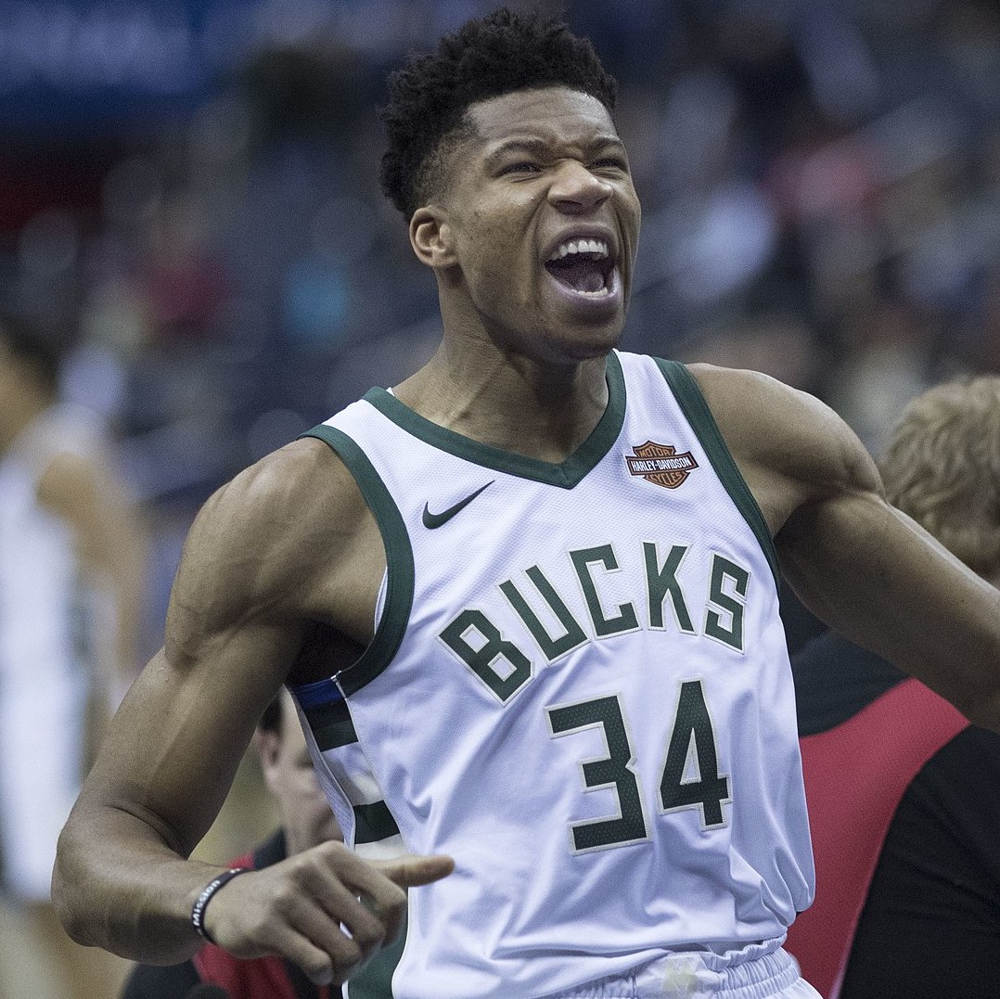
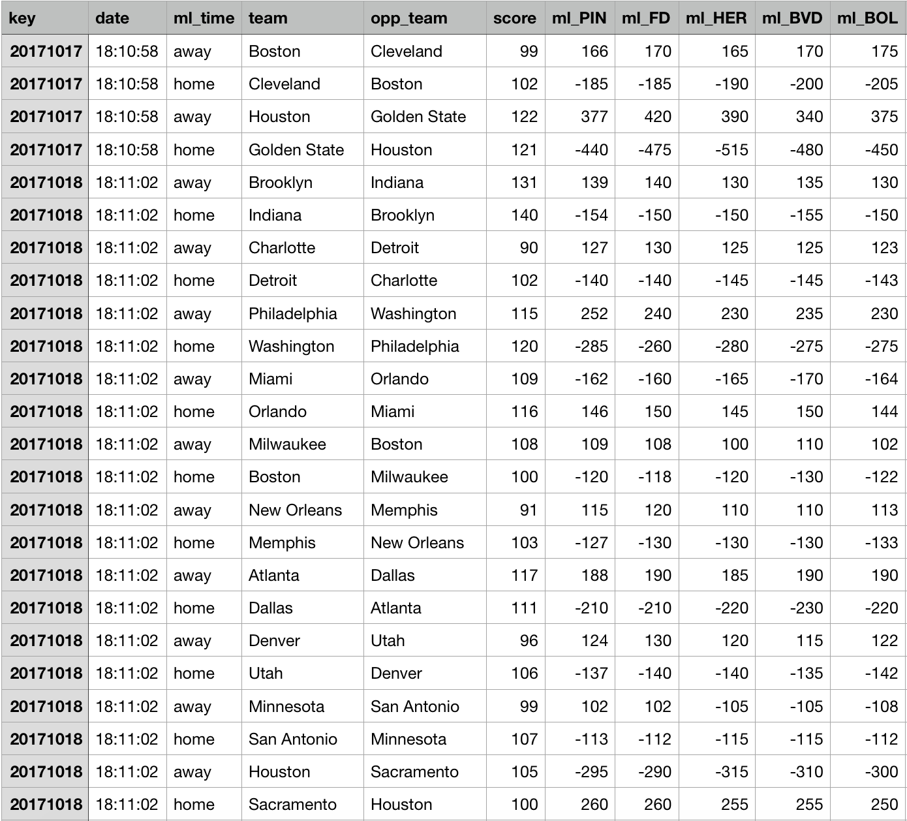
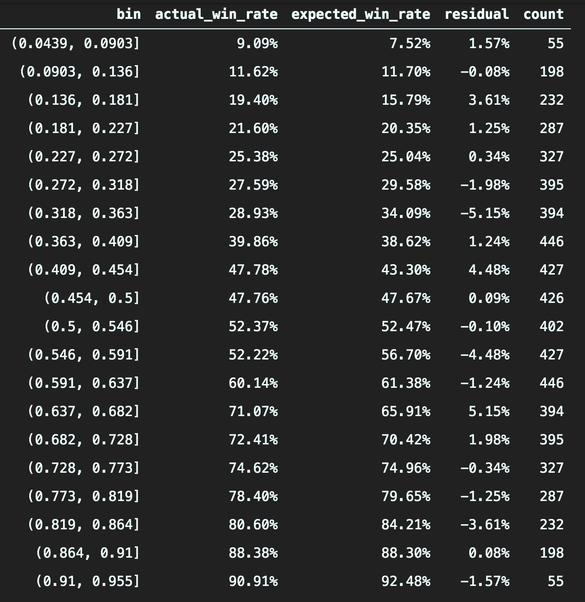
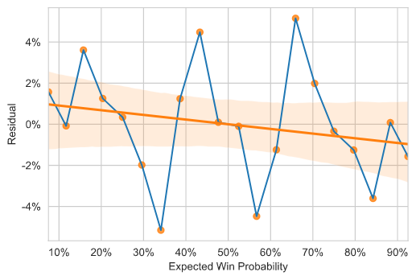
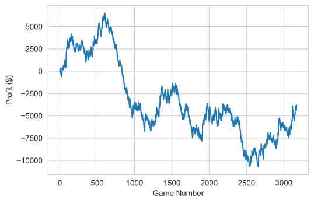
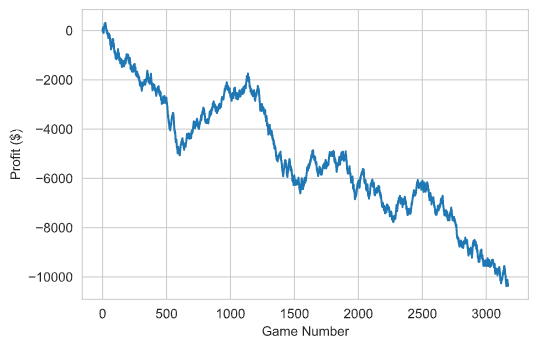
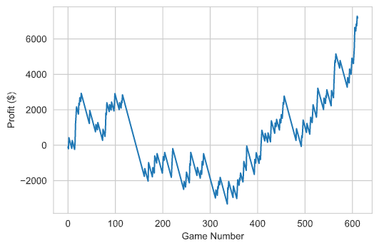

You might be surprised to learn that the NBA teams that win the most games do NOT win bettors the most money!

In this post, I will analyze NBA betting data and run simulations to show you why this has historically been true — and explain which teams you should bet on instead. You won’t even need basketball knowledge to successfully implement this strategy.

Although you don’t need to be an NBA expert, this post assumes you have some knowledge of sports betting concepts and terminology. If you aren’t familiar with them, check out this [short guide](https://www.actionnetwork.com/how-to-bet-on-sports/general/sports-betting-for-beginners-10-things-to-know) for a primer.

### How accurate are betting odds?

Let’s start with the basics — when two NBA teams play each other, one team is considered more likely to win (the favorite) while the other more likely to lose (the underdog). If you were to place a [moneyline bet](https://www.actionnetwork.com/education/moneyline) on the underdog, you’d win more money than if you had bet on the favorite; after all, you deserve a bigger reward for picking the less likely winner. Based on the payouts set by the sportsbook, you can calculate the [implied probability](https://www.investopedia.com/articles/dictionary/042215/understand-math-behind-betting-odds-gambling.asp) of each team winning the game.

In theory, the implied probability of winning your bet should be identical to the probability of your team winning the game. In reality, sportsbooks don’t set their odds that way. Instead, they invite action on both sides so the amount of money at stake is balanced, thus reducing their risk and maximizing their profit.

For example, let’s say the Milwaukee Bucks (the team with the best record last year) are playing against the New York Knicks (a team with… _not_ the best record). If bettors rush to bet on the Bucks, the sportsbooks may get nervous about paying out a _lot_ of money if the Bucks win. So they decide to reduce their payout for the Bucks and increase their payout for the Knicks, thus incentivizing more money to be placed on the Knicks’ side.

Giannis Antetokounmpo, the star of the Milwaukee Bucks, possibly excited about winning a bet. Source: [Wikimedia.org](https://commons.wikimedia.org/wiki/File:Giannis_Antetokounmpo_%2824845003687%29_%28cropped%29.jpg)

These payouts could swing such that implied probability of a Bucks win is 90%, when in reality their “true win probability” might only be 80%. In this case we have a value bet, where it would be profitable in the long-run to bet on the Knicks.

Of course, the big challenge that all bettors face is finding the true win probability of each bet AND figuring it out before everyone else does. It’s impossible to know these win probabilities for certain, but can we find games where the implied odds are more likely to be inefficient? This could help us spot opportunities for value bets.

### Step 1: Getting data

First things first, we need a large dataset for our analysis. We’ll need data for the following:

1.  The betting odds of each game. We use this info to determine which team to bet on, and if we win the bet, the amount of our winnings.
2.  The winner of each game. We need to know whether we won our bets or not.

I ended up using [Sportsbook Review](https://www.sportsbookreview.com/betting-odds/nba-basketball/), a site that aggregates historical betting odds from many different sportsbooks. From there, I found an open-source repository with a script that can effectively scrape betting data from any historical NBA game. [I modified the script](https://github.com/lambertchu/SBRscraper/pull/1) to also scrape the final score of each game and to run for an entire NBA season, which I did for three regular seasons: 2017–18, 2018–19, and 2019–20 (only including games before the pandemic suspended the season). Here’s a snapshot of what the dataset looks like:

There are a lot of different ways to place bets on NBA games, like moneylines, point spreads, point totals, etc. For the sake of this post, I’ll focus exclusively on the profitability of moneylines. Similarly, there are many different sportsbooks you can use to bet. For the sake of simplicity, I will focus exclusively on [Pinnacle](https://www.pinnacle.com/en/), which is regarded as having some of the most accurate odds in the industry.

### Step 2: Finding differences in implied probability

The goal here is to examine the implied odds of past NBA games and determine if they’ve been historically accurate. If there are big discrepancies, then there could be an opportunity to make money.

I calculated the implied win probability for each bet based on their moneyline odds. You might notice that the sum of the win probabilities in each game is greater than one, which shouldn’t be possible! However, sportsbooks do this on purpose to profit from the total betting action. To adjust for this, I normalized the win probabilities to add up to one, which results in the REAL implied win probability for each bet.

Next, I created “bins” so that all bets with similar implied win probabilities are grouped together. Why do this?

Suppose we have a bet with an implied win probability of 11.7% (or +755 moneyline). It’s hard to find many other bets that have this exact moneyline. But if we include it in a bin of all bets from 10% to 15%, then we have quite a few data points to look at in each bin. We then calculate each bin’s _actual win rate_ (number of real-life wins divided by total number of games) and _expected win rate_ (average implied win probability of all bets in the bin).

From there, we can take the difference between the actual win rates and expected win rates — which I’ll call the residual — and see if there are any large discrepancies. Here are the results when dividing all bets into 20 bins. Each bin covers an implied win probability interval of about 5 percentage points.

The _b_in column shows the probability interval in decimal form. The \_co_unt column shows the total number of bets in each bin. Notice that the counts are symmetric across the middle row, with the exception of the (\_0.456, 0.5\]_ interval having 12 games (24 bets) with exactly 50/50 odds.

It turns out that the implied win probabilities (and therefore the moneylines) are pretty accurate! In general, the actual and expected win probabilities don’t differ by more than 5%. However, there is a slight negative correlation between residual and expected win rate. It appears that huge underdogs have been slightly underrated, while huge favorites have been slightly overrated.

### Step 3: Simulating the strategies

Now, it’s time to put my (imaginary) money where my mouth is. In the last section, we found that huge underdogs might actually be slightly undervalued. What happens if we simulate betting on underdogs over the last three NBA seasons? We’ll backtest with actual game results and Pinnacle moneylines from the 2016–17 to 2019–20 seasons.

I wrote a function that simulates a betting strategy and tracks our winnings over time. We first must set a bet amount, which will be $100 every time for the sake of simplicity. We must also set a “win probability threshold,” which determines the underdog teams we’ll bet on. If we set it to 0.5, then we bet on any team with a win probability less than 50% (aka the underdog of every game). If we set it to 0.2, then we only bet on the big underdogs of lopsided games, where the win probability is less than 20%.

We’re ready to go now. What happens if we run the simulation with a threshold of 0.5, which places a $100 bet on the underdog of every game?

Oh no, we lost money! **We lost** **$3,903** after three seasons, with an especially brutal stretch from bets 600 to 1,000.

It’s worth noting that the expected value of every bet is negative. As I mentioned earlier, the sportsbook takes a cut of every bet through the [virgorish](https://en.wikipedia.org/wiki/Vigorish) or “vig.” Pinnacle has a vig of about 2–3%, which is actually quite low. Any strategy that is profitable must be at least 3% better than break-even!

Next, let’s try the _exact opposite_ strategy and bet on the _favorite_ of every game. After a tiny tweak to my simulator function, we get the following results over time:

What an absolute nightmare! With this strategy, **we** **lost $10,352**. Comparing this graph with the previous one, we can see that the trends move in opposite directions (as they should), but the winnings are completely outweighed by the magnitude of the losses.

Finally, let’s test our hyped-up strategy of betting on huge underdogs. What happens if we run the simulation with a threshold of 0.2?

We make a **total profit of $7,182**!! Not bad at all!

One really important caveat is that we lost nearly $3,000 before making profits afterwards. In order to survive with this strategy, you will need to have a large bankroll and/or make small-sized bets. Otherwise, it’d be easy to go on a long losing streak and completely run out of cash.

If you’d like to check out my complete Jupyter notebook, you can find it [here](https://github.com/lambertchu/SBRscraper/blob/master/sbr_profitability.ipynb).

### Conclusion: Find the big-time underdogs

Based on this analysis, there has historically been a profitable strategy by betting on big-time underdogs. You could think of every bet as a lottery ticket with a high likelihood of losing but a large upside.

I do think it’s feasible that these underdogs are relatively “underpriced” while the heavy favorites are “overpriced.” There may be a psychological explanation for a lot of bettors; people might want to win more _often_ at the cost of long-term monetary returns!

In summary, this underdog strategy requires patiently enduring long losing streaks, placing small-sized bets, and having a big enough bankroll. However, if the bottom-feeders of the NBA can pull off enough rare Ws, you just might be able to make cash.

And by the way, the Knicks already beat the Bucks this season, despite having just a 12% implied win probability for that game! Perhaps a sign of things to come.

---
