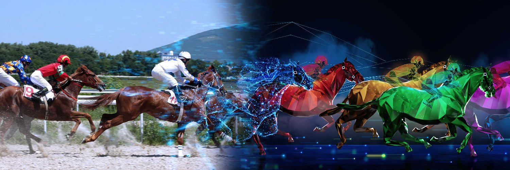

_Source: ZED RUN’s [Twitter page](https://twitter.com/zed_run)._

Stella Artois just [announced a partnership](https://www.forbes.com/sites/cathyhackl/2021/06/18/stella-artois-gallops-into-the-metaverse-with-horse-racing-nfts/amp/) with a horse racing platform. No, it was not with the Kentucky Derby or the Belmont Stakes. It was with a purely digital, NFT horse racing platform called [ZED RUN](http://zed.run).

NFTs and horse racing? How in the world do those things go together? Click on the video below and see for yourself:

ZED RUN has a slick, futuristic, and almost alien vibe — yet it clearly has the mechanics of real-life horse racing.

There are a plenty of interesting NFT projects out there, but ZED is my personal favorite. Not only are the races captivating to watch and the horses fun to collect, the game brings a fresh take on sports gambling to the NFT metaverse. They have created an NFT with a remarkable amount of utility.

In this article, I’ll explain why it’s time for you to start paying attention to ZED RUN — and why I believe it will set the standard for NFTs of the future.

Please keep in mind that this article is NOT meant to be investment advice. These are my personal opinions and should solely be used for informational purposes!

### Providing Access to Ownership

At first glance, you might think ZED RUN’s concept of horse racing is the same as [virtual horse racing](https://www.bettingusa.com/racing/virtual/) at casinos. However, ZED is an entirely different beast for one key reason: you actually OWN the digital horses that you bet on. Being a ZED stable owner is probably the closest we’d get to living the life of a Kentucky mogul!

Like other NFT assets, ownership of ZED horses is verifiable on the Ethereum blockchain. The horses are divided into tiers, which are generally predictive of their racing ability. The top tier (Z1 Genesis Nakamoto) can fetch nearly $40,000 on the secondary market, but lower tiers sell for a more affordable price of a few hundred dollars.

As a comparison, the average cost of a real-life racehorse is about [$76,000](https://horseracingsense.com/how-much-does-a-racehorses-cost/#:~:text=The%20cost%20of%20racehorses%20varies,for%20a%20yearling%20is%20%2484%2C722.). However, that doesn’t include the time and money to keep it alive and train it for the racetrack. Thankfully, as of now, ZED horses don’t need to be fed, cannot die, and are ready to kick butt on the racetrack right after birth.

Speaking of birth, stable owners can actually breed their horses to produce offspring — which results in a brand-new horse NFT being minted on the blockchain. If an owner has a male horse, they can charge a stud fee for other owners to sire offspring. If an owner has a female horse, they get to keep the offspring that is born.

_Starlet + Honey Nut = Vanilla Bean. Source: [Know Your Horses](https://knowyourhorses.com/horses/18904/ancestry)._

The racing ability of a bred horse is heavily influenced by its parents, but there are “mutations” that could lead to highly variable outcomes. This means that amazing racers can still be bred from cheaper horses, which gives people with less money an opportunity to score a big-time performer.

In the real world, owning, breeding, and racing horses has only been accessible to only the wealthiest of degenerates. But now in the metaverse, it’s available to ALL degenerates.

Ultimately, this is the direction I believe NFTs will move towards in the future: mirroring ownership of real-life assets to make them accessible to a wider audience.

### Bringing Transparency to Horse Racing

In the ZED RUN racing engine, the outcome of each race is randomly generated. However, each horse’s innate racing ability heavily influences their odds of winning. After enough races, it becomes apparent which horses are studs and which are donkeys.

\*The numbers don’t lie: Breathless Edge is a beast. Source: [Know Your Horses](https://knowyourhorses.com/horses/274).

Since the stats are completely visible and the game dynamics are just transparent enough to analyze, it opens up a whole new realm for finding betting edges. Just like sports bettors can use statistics to gain an edge, ZED stable owners can perform their own analyses to profit from racing. Races are visually entertaining AND have real money at stake, which makes them as exciting to me as a real-world sports betting event.

When it comes to betting and competing, I believe there is a greater element of fairness and transparency in ZED RUN than in most sports. Sure, there can be bugs that lead to wonky race results — but as long as the ZED platform itself is well implemented, it’s near impossible for players to cheat the system.

Real-world horse racing certainly has its own set of codified rules, but they are much harder to enforce. The racing community just had a major scandal where Medina Spirit, the winner of the 2021 Kentucky Derby, [tested positive for steroids](https://www.nytimes.com/2021/06/02/sports/horse-racing/kentucky-derby-medina-spirit-baffert.html).

In the ZED universe, there’s no need to worry about horses on PEDs that create an unfair competitive environment. As an added bonus, there’s also no need to worry about unfortunate horses getting drugged — or any other form of animal cruelty.

### Generating Cash Value for Assets

Most people can look at ZED RUN’s graphics and understand how it can be fun and entertaining. ZED has also done a great job of [gamifying](https://en.wikipedia.org/wiki/Gamification) their NFTs on top of the traditional NFT collecting experience.

But here’s what separates it from other NFT projects: a winning horse is a productive asset. Due to the nature of the game, a horse that consistently wins on the racetrack (or fathers a lot of baby horses) brings in very real cash flow. A winning horse is an asset that brings you cash, which is inherently valuable, just like owning equity in a company. You can’t really say the same for all NFTs out there.

There’s an [excellent article](https://link.medium.com/x4ZnTaSwUgb) written by Tony Yiu that plays devil’s advocate for crypto assets. He believes that “an asset with no cash flows can have value — but that value is highly subjective, heavily affected by emotions, and volatile as there is nothing tangible underneath to serve as its anchor.”

I’m very bullish on crypto assets, but I think he’s right. In order for crypto assets, especially NFTs, to become more than just speculative investments in the eyes of the general public, there needs to be more tangible benefits, whether it’s in the form of cash or other added utility.

My rebuttal to his article is ZED RUN, an NFT that actually can bring you the dough. Smart bettors have and will continue to make money from ZED, just like in sports betting and DFS. As long as that opportunity exists in the game, winning ZED horses are productive assets.

In the future, I see NFTs looking LESS like weird memes and MORE like cash-generating assets such as ZED horses.

### Impact on the future of NFTs

In my opinion, ZED RUN is an example of an NFT project done right. Other projects should look to add utility — as well as gamifying the experience and promoting a community — to bolster the long-term value of the project. There will always be a place for collecting NFTs, especially as works of art. But I have my doubts about NFTs truly going mainstream unless they find a way to add real-world utility.

ZED is on track (pun somewhat intended) to do that for real-life horse racing. It’s currently the gold standard NFT project in my book. ZED RUN is a glimpse into the future of NFTs — where tangible assets are slowly transformed into digital ones and the lines between the two worlds are ever blurred.

Before signing off, I’ll leave you with a glimpse of what that future could look like:

<blockquote class="twitter-tweet">
&quot;Life for the people on Novus revolves around one thing, the digital horse racing league, Zed Run. It is the world&#39;s premiere sporting event. In fact, for many, it&#39;s more than just a sport, it&#39;s a way of life, because Zed Run allows anyone to own and race digital horses.&quot; 🏇🚀🌔 <a href="https://t.co/CHiCyMAttA">pic.twitter.com/CHiCyMAttA</a>
&mdash; Chris Ebeling (@iamChrisEbeling) <a href="https://twitter.com/iamChrisEbeling/status/1397390439494283265?ref_src=twsrc%5Etfw">May 26, 2021</a></blockquote> 
